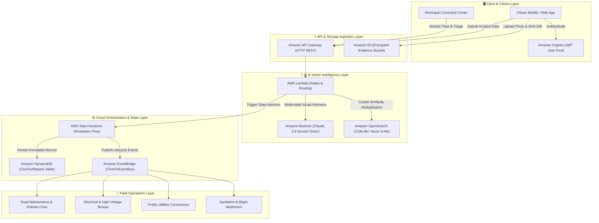

<div align="center">

  <!-- Animated Header Banner -->
  

  <br/>

  <!-- Dynamic Typing Headline -->
  <a href="https://git.io/typing-svg">
    
  </a>

  <br/><br/>

  <!-- Badges Grid -->
  <p align="center">
    
    
    
    
    
  </p>

  <p align="center">
    <a href="#-live-demo--quickstart"><b>⚡ Live Quickstart</b></a> •
    <a href="#-architecture-diagram"><b>🏛️ Cloud Architecture</b></a> •
    <a href="#-ai-vision-pipeline"><b>🧠 Bedrock AI Engine</b></a> •
    <a href="#-hackathon-demo-flow"><b>🎬 2-Min Demo Script</b></a> •
    <a href="#-aws-services-matrix"><b>☁️ AWS Services</b></a>
  </p>

</div>

---

<br/>

## 🌐 Project Overview

**CivicFix AI** transforms raw citizen reports into prioritized municipal action. By combining **Amazon Bedrock multimodal vision**, **Amazon S3 cryptographic evidence storage**, **Amazon OpenSearch vector duplicate detection**, and **AWS Step Functions state machine orchestration**, CivicFix eliminates bureaucratic delay and ensures life-safety hazards are triaged in under 60 seconds.

```
┌─────────────────┐       ┌─────────────────┐       ┌─────────────────┐
│     CITIZEN     │  ───► │  AMAZON BEDROCK │  ───► │  STEP FUNCTIONS │
│  Shutter Click  │       │ Multimodal 94%  │       │ Auto-Dispatch   │
└─────────────────┘       └─────────────────┘       └─────────────────┘
                                   │                         │
                                   ▼                         ▼
                          ┌─────────────────┐       ┌─────────────────┐
                          │   OPENSEARCH    │       │    DYNAMODB     │
                          │ Vector Cluster  │       │ Immutable State │
                          └─────────────────┘       └─────────────────┘
```

---

## 🚀 Key Highlights & Capabilities

<table>
  <tr>
    <td width="50%">
      <h3 align="center">🌆 Cinematic 3D Abstract City</h3>
      <p align="center">
        Full-screen interactive canvas rendering an isometric city grid with dynamic arterials, data pulses, and mouse parallax interaction.
      </p>
    </td>
    <td width="50%">
      <h3 align="center">🧠 Multimodal AI Vision</h3>
      <p align="center">
        Amazon Bedrock evaluates raw photographic evidence, calculates severity scores (0–100), isolates hazards, and plans remediation.
      </p>
    </td>
  </tr>
  <tr>
    <td width="50%">
      <h3 align="center">⚡ Priority Chaos-to-Order Triage</h3>
      <p align="center">
        Incoming unstructured complaints dynamically reorganize into categorized priority lanes (Critical, High, Medium, Low).
      </p>
    </td>
    <td width="50%">
      <h3 align="center">🔒 Cryptographic Forensics</h3>
      <p align="center">
        Client-side SHA-256 evidence integrity hashing, S3 encrypted storage, and EXIF coordinate cross-validation.
      </p>
    </td>
  </tr>
  <tr>
    <td width="50%">
      <h3 align="center">🗺️ Live Geospatial Radar Map</h3>
      <p align="center">
        Dark CartoDB Matter Leaflet map featuring custom glowing status markers (🔴 Critical, 🟠 High, 🟡 Medium, 🟢 Resolved).
      </p>
    </td>
    <td width="50%">
      <h3 align="center">🔄 AWS Dual-Mode Engine</h3>
      <p align="center">
        Seamless 1-click toggle between <b>Real AWS Mode</b> (live Bedrock, S3, DynamoDB) and <b>Zero-Config Local Demo Mode</b>.
      </p>
    </td>
  </tr>
</table>

---

## 🏛️ Architecture Diagram



---

## ☁️ AWS Services Matrix

| AWS Managed Service | Concrete Implementation in CivicFix AI |
| :--- | :--- |
| **Amazon Bedrock** | Multimodal feature extraction, hazard classification, severity scoring (0–100), and remediation guidance via `anthropic.claude-3-5-sonnet-20241022-v2:0`. |
| **Amazon S3** | Encrypted object storage (`AES-256`) with SHA-256 evidence integrity validation and pre-signed upload URLs. |
| **Amazon DynamoDB** | Ultra-low latency NoSQL persistence with Global Secondary Indexes (`StatusCreatedAtIndex`, `DepartmentCreatedAtIndex`). |
| **Amazon OpenSearch** | 1536-dimensional vector embedding k-NN similarity search to detect duplicate reports within municipal coordinates. |
| **Amazon EventBridge** | Real-time event bus broadcasting `CivicFix.ReportCreated` and `CivicFix.StatusUpdated` to municipal dispatch centers. |
| **AWS Step Functions** | Amazon States Language (ASL) state machine coordinating intake validation, severity branching, and SLA timers. |
| **AWS Lambda** | High-performance Node.js 20.x serverless handlers executing CRUD APIs and Bedrock runtime callers. |
| **Amazon API Gateway** | HTTP API Gateway with CORS, rate-limiting, and payload schema validation. |
| **Amazon Cognito** | Secure user identity pools for resident citizens and city dispatchers. |

---

## 🎬 Hackathon Demo Flow (2–3 Minutes)

<details open>
<summary><b>Click to expand Judge Demo Script</b></summary>
<br/>

1. **The Vision (0:00 – 0:30)**:
   - Launch `http://localhost:3000/`. Show the **3D abstract city canvas** reacting to mouse parallax.
   - Introduce the tagline: *"THE CITY THAT LISTENS"* — turning citizens into active sensors.
2. **Scroll Storytelling (0:30 – 1:00)**:
   - Scroll through Section 01 (*Metropolitan Radar*), Section 02 (*Bedrock Vision Pipeline*), Section 03 (*Serverless Flow*), Section 04 (*Interactive Severity Triage*), and Section 05 (*Resolution Progression*).
3. **Multi-Step Incident Intake (1:00 – 1:45)**:
   - Click **"Report Issue"**.
   - Select the 1-click test preset **"Severe Asphalt Cavity"**.
   - Watch the animated Bedrock inference stepper (S3 upload → Bedrock Vision → OpenSearch vector search → Step Functions execution).
   - Review the structured result: **Severity 94/100 (CRITICAL)**. Click **"Confirm & Submit"** to trigger DynamoDB persistence and celebratory confetti.
4. **Command Center & Deep Dive (1:45 – 2:30)**:
   - Explore the **Command Center** KPIs and open an incident to inspect the Bedrock bounding box and SHA-256 fingerprint.
   - Switch to **Live Map** to view dark Leaflet tiles and pulsing markers.
   - Open **AI Center** to test Bedrock foundation models and vector duplicate threshold sliders.
   - Open **Workflows** to inspect the AWS Step Functions state machine DAG and ASL definition.
5. **AWS Cloud Proof (2:30 – 3:00)**:
   - Click the **AWS Stack** badge to open the live architecture modal, demonstrating the 8 active AWS services and streaming CloudWatch / EventBridge logs.

</details>

---

## 🌟 CIVICFIX AI 2.0: Intelligent Civic Response Platform

CivicFix AI 2.0 elevates the application from simple complaint ingestion into an enterprise-grade civic response intelligence platform:

| Innovation | Core Capability | Judge Impact |
|---|---|---|
| **Civic Impact Score** | Proprietary 0–100 multi-factor formula (Safety Risk, Footfall Density, Severity, Report Density, Issue Age) | Replaces chronological silos with true municipal impact triage |
| **AI Priority Queue** | Real-time ranked queue ("URGENT ACTION") with expandable *"Why Priority 96?"* rationale | Instant explainability for municipal decision-makers |
| **Civic Hotspots & Digital Twin** | Sector health scores (Sector 14: 72/100, Campus Gate: 84/100) with density metrics and weekly velocity trends | Macro visibility into deteriorating corridors |
| **Predictive Civic Alerts** | Experimental velocity forecasting (e.g. *"Market Road garbage reports surged 41%"*) with genuine *"Insufficient data"* fallbacks | Prevents catastrophic failures before citizen escalation |
| **AI Root-Cause Insights** | Correlates repetitive symptoms (e.g. 23 streetlight complaints → subterranean feeder failure in Vault 14-C) | Solves systemic causes instead of repeatedly treating symptoms |
| **Duplicate Merge Intelligence** | Vector deduplication unifies clustered complaints into Master Incident **INC-2048** (6 reports → 1 dispatch workflow) | Eliminates duplicated contractor runs and saves municipal funds |
| **Citizen Trust Timeline** | Public 6-stage milestone tracker (*Reported → Verified → Assigned → Field Notified → In Progress → Resolved*) | Complete civic transparency without exposing internal PII |
| **Before / After Resolution Proof** | Interactive split-image comparison slider with inspector badge verification and timestamps | Visual accountability; issues cannot close without photographic proof |
| **CivicFix Operations Copilot** | Grounded natural language assistant answering risk queries, SLA breaches, and department backlogs using live data | Conversational operations copilot for city administrators |
| **Command Center (Cmd+K)** | Keyboard-driven command palette for instant search, page navigation, and diagnostic tools | Power-user speed for operations center dispatchers |
| **Real-Time Operations Stream** | Live timestamped event bus reflecting API Gateway, Bedrock, DynamoDB, and EventBridge activity | Transparent verification of cloud telemetry |
| **Multilingual Reporting** | Native dictionary localization supporting **English**, **Hindi (हिन्दी)**, and **Odia (ଓଡ଼ିଆ)** | Democratic, accessibility-first civic engagement |
| **Judge Mode & Architecture Explorer** | 20-second elevator pitch, 10/10 operational AWS service health dots, and node-by-node architecture inspector | Rapid technical evaluation for hackathon judges |

---

## ⚡ Live Demo & Quickstart

### Prerequisites
- Node.js 18+
- npm

### 1-Command Local Launch
```bash
# Clone the repository
git clone https://github.com/exepngsam/Civicfix-ai.git
cd Civicfix-ai

# Install dependencies
npm install

# Start development server
npm run dev
```

Open [http://localhost:3000](http://localhost:3000) in your browser. The application runs immediately in **DEMO MODE** with full functionality!

---

## 🛠️ Deploying to AWS via SAM

```bash
cd backend

# Build SAM application
sam build

# Deploy with guided wizard
sam deploy --guided
```

Once deployed, copy the output `HttpApiUrl` into your `.env` file:
```env
VITE_API_BASE_URL=https://xxxxxxxxxx.execute-api.us-east-1.amazonaws.com
VITE_AWS_REGION=us-east-1
```

---

## ⚖️ Hackathon Disclosure & Credits

- **AI Coding Tools**: Antigravity AI (powered by Gemini Flash High).
- **Open-Source Libraries**: React 18, Vite, TailwindCSS, Lucide Icons, Leaflet, Canvas-Confetti, AWS SDK v3.
- **License**: Released under the [MIT License](LICENSE).

<br/>

<div align="center">
  <sub>Built with ❤️ for the AWS Hackathon • CivicFix AI — The City That Listens</sub>
</div>
