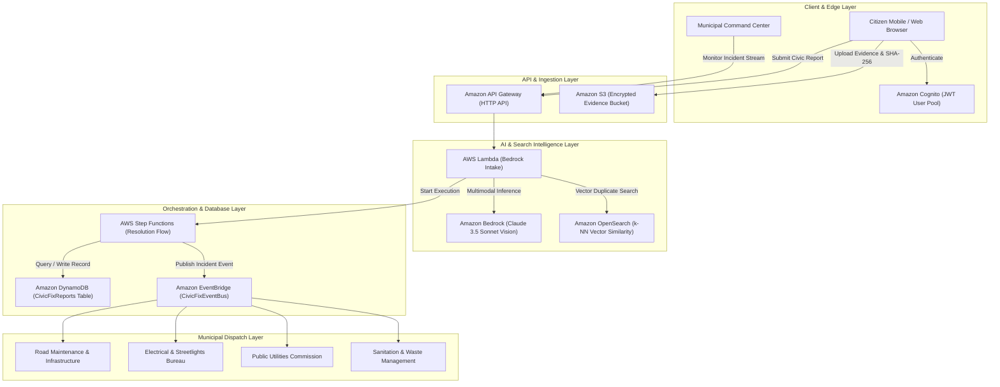

# CIVICFIX AI — "The City That Listens"
### AI-Powered Civic Intelligence & Automated Resolution Platform for AWS Hackathon

[](https://aws.amazon.com)
[](https://aws.amazon.com/bedrock/)
[](https://aws.amazon.com/dynamodb/)
[](LICENSE)

> **CivicFix AI** transforms raw citizen complaints into prioritized municipal action. By combining **Amazon Bedrock multimodal vision**, **Amazon S3 cryptographic evidence storage**, **Amazon OpenSearch vector duplicate detection**, and **AWS Step Functions state machine orchestration**, CivicFix eliminates bureaucratic delay and ensures life-safety hazards are triaged within seconds.

---

## 1. Problem & Solution

### The Civic Bottleneck
Cities receive thousands of unstructured resident reports every day: deep asphalt cavities, exposed 240V streetlight cables, ruptured water mains, and overflowing hazardous refuse. Most civic portals act as passive digital dropboxes where complaints sit unread for weeks, duplicate reports flood dispatch centers, and life-safety threats remain lost in noise.

### The CivicFix AI Breakthrough
CivicFix turns every smartphone into an active civic sensor and automates triage:
1. **Multimodal Vision Intake**: Citizens upload a photo and short description. Amazon Bedrock (Claude 3.5 Sonnet) extracts visual features, identifies exposed hazards, and calculates a rigorous Severity Score (0–100).
2. **Vector Duplicate Clustering**: Amazon OpenSearch evaluates 1536-dimensional embeddings across local coordinates to detect duplicate reports and cluster related complaints.
3. **Automated Step Functions Resolution**: High-severity incidents (score ≥ 85) instantly trigger emergency 2-hour SLAs, assign the appropriate municipal bureau in DynamoDB, and emit real-time event notifications via Amazon EventBridge.
4. **Transparent Verification**: Before and after photographic verification ensures repairs are physically verified by AI before an incident can close.

---

## 2. Cloud Architecture (Mermaid Diagram)



---

## 3. AWS Services Visibly Integrated

| AWS Service | Concrete Role in CivicFix AI |
| :--- | :--- |
| **Amazon Bedrock** | Multimodal feature extraction, hazard classification, severity scoring (0–100), and remediation recommendation via `anthropic.claude-3-5-sonnet-20241022-v2:0`. |
| **Amazon S3** | Encrypted object storage for citizen evidence photos with client-side SHA-256 fingerprint validation and pre-signed upload URLs. |
| **Amazon DynamoDB** | Ultra-low latency NoSQL persistence for reports, metadata, and audit logs with Global Secondary Indexes (`StatusCreatedAtIndex`, `DepartmentCreatedAtIndex`). |
| **Amazon OpenSearch** | 1536-dimensional vector embedding k-NN similarity search to detect duplicate reports and group localized municipal failures. |
| **Amazon EventBridge** | Event choreography broadcasting `CivicFix.ReportCreated` and `CivicFix.StatusUpdated` to city operations centers. |
| **AWS Step Functions** | Amazon States Language (ASL) automated workflow coordinating intake validation, severity branch gating, department queue assignment, and SLA timers. |
| **AWS Lambda** | Serverless Node.js 20.x execution handlers running CRUD APIs and Bedrock invocation payloads. |
| **Amazon API Gateway** | HTTP API Gateway with CORS, rate-limiting, and JSON payload validation. |
| **Amazon Cognito** | Secure user identity pools for resident citizens and municipal city dispatchers. |

---

## 4. Zero-Config DEMO MODE vs. Real AWS Mode

In strict adherence to hackathon rules (*"No fake features, technical honesty is mandatory"*):
- **DEMO MODE (Local)**: When AWS credentials or endpoints are not configured, the application displays `DEMO MODE: LOCAL` in the UI. All operations (Bedrock multimodal reasoning, S3 integrity checks, OpenSearch duplicate searches, Step Functions execution trees) run against an authentic local simulation engine with realistic timing (700–900ms), mock telemetry logs, and pre-loaded high-resolution civic test imagery.
- **REAL AWS MODE**: When configured with `VITE_API_BASE_URL` or AWS IAM credentials, the application displays `AWS: CONNECTED`, dispatching live requests to the deployed AWS SAM stack.
- **Instant Mode Switcher**: You can toggle between modes at any time using the mode pill in the top navigation bar or sidebar.

---

## 5. 2–3 Minute Hackathon Judge Demo Script

1. **The Pitch (0:00 – 0:30)**:
   - Open the landing page. Point to the **3D abstract city grid** with mouse parallax.
   - Explain the mission: *"Cities are fracturing under silent strain. CivicFix AI turns every citizen into a sensory node and eliminates bureaucratic delays using Amazon Bedrock."*
2. **Scroll Storytelling (0:30 – 1:00)**:
   - Scroll through the 5 storytelling sections:
     - **See the Problem**: Interactive radar mapping potholes, live wires, and water main fractures.
     - **AI Understands**: The 5-stage Bedrock multimodal inference pipeline.
     - **From Report to Action**: The AWS Serverless cloud flow.
     - **Priority, Not Noise**: Click *"Execute AI Severity Triage"* to show unstructured complaints sorting into prioritized critical lanes.
     - **Resolution You Can See**: Verified progression to repair.
3. **Multi-Step Report Wizard (1:00 – 1:45)**:
   - Click **"Report Issue"**.
   - Select the 1-click test preset **"Severe Asphalt Cavity"**.
   - Advance through GPS location and description.
   - Watch the cinematic Bedrock analysis stepper (S3 upload → Bedrock Vision → OpenSearch vector search → Step Functions execution).
   - Review the structured result: **Severity 94/100 (CRITICAL)**. Click **"Confirm & Submit"** to trigger DynamoDB indexing and celebration confetti.
4. **Command Center & Subsystems (1:45 – 2:30)**:
   - Enter the **Command Center**.
   - Show the live **Leaflet Dark Map** with custom pulsing markers (Critical 🔴, High 🟠, Medium 🟡, Resolved 🟢).
   - Open the **AI Center** to demonstrate Bedrock model inspection, prompt directives, and vector duplicate threshold sliders.
   - Open the **AWS Step Functions Visualizer** to inspect the state machine DAG and ASL definitions.
   - Open the **Evidence Intelligence** tab to show SHA-256 checksums and S3 bucket integrity proof.
5. **AWS Telemetry & Cloud Proof (2:30 – 3:00)**:
   - Click the **AWS Stack** badge to open the live architecture modal and stream real-time EventBridge and CloudWatch logs.

---

## 6. Local Setup & Running Instructions

### Prerequisites
- Node.js 18+ (tested on Node v24.18.0)
- npm or yarn

### Quickstart (Runs in 1 Command)
```bash
# 1. Clone or navigate to the repository directory
cd d:/exe

# 2. Install dependencies
npm install

# 3. Launch local development server
npm run dev
```

Open [http://localhost:3000](http://localhost:3000) in your browser. The application runs immediately in **DEMO MODE** with full functionality!

### Production Build & Typecheck
```bash
npm run build
```
Builds an optimized production bundle in `/dist` with zero TypeScript or bundling errors.

---

## 7. Deploying to AWS (AWS SAM)

To deploy the backend to your AWS account:

```bash
cd backend

# Build SAM application
sam build

# Deploy with guided wizard
sam deploy --guided
```

Once deployed, copy the `HttpApiUrl` output from the SAM deployment and add it to your `.env` file:
```env
VITE_API_BASE_URL=https://xxxxxxxxxx.execute-api.us-east-1.amazonaws.com
VITE_AWS_REGION=us-east-1
```

---

## 8. AI Coding Tools Disclosure & Open-Source Licenses

In accordance with Hackathon guidelines:
- **AI Coding Tools Used**: Antigravity AI (powered by Gemini Flash High) for architectural design, code generation, component styling, and documentation.
- **Open-Source Libraries**:
  - `react` & `react-dom` (MIT)
  - `vite` (MIT)
  - `tailwindcss` (MIT)
  - `lucide-react` (ISC)
  - `leaflet` (BSD 2-Clause)
  - `canvas-confetti` (ISC)
  - `@aws-sdk/client-bedrock-runtime`, `@aws-sdk/client-dynamodb`, `@aws-sdk/client-s3`, `@aws-sdk/client-eventbridge` (Apache-2.0)
- **Map Tiles**: CartoDB Dark Matter (Free for non-commercial evaluation / OSM Contributors).

---

## 9. Known Limitations & Roadmap

- **Roadmap**: Native mobile push notifications via Amazon SNS.
- **Roadmap**: Drone automated aerial verification via AWS IoT Core.
- **Limitation**: Real Bedrock inference requires AWS Account model access approval for Anthropic Claude 3.5 Sonnet in your selected region (`us-east-1` or `us-west-2`).
